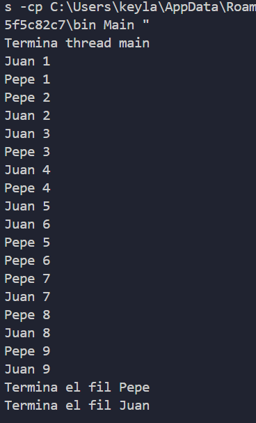

Keyla Batzin
12/12/24

# Activitat 01: Programació de fils

Explicacio sobre la practica e introducion

## Comportament 1

### Codi
```java
public class Fil extends Thread {
    private String nom; // Nombre del hilo

    public Fil(String nom) {
        this.nom = nom; // Inicializa el nombre
    }

    @Override
    public void run() {
        try {
            for (int i = 1; i <= 9; i++) {
                System.out.println(nom + " " + i);
                Thread.sleep((int) (Math.random() * 200) + 100); // Pausa entre 100ms y 300ms
            }
            System.out.println("Termina el fil " + nom); // Mensaje al finalizar
        } catch (InterruptedException e) {
            System.out.println("El fil " + nom + " ha estat interromput.");
        }
    }
}
```

### Execució:



### Explicació

Texto donde se explica

## Comportament 2

