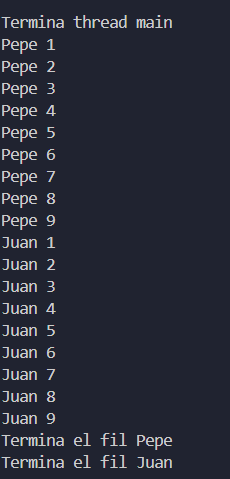
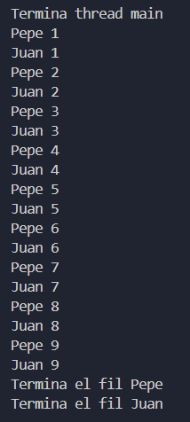

# Activitat 01: Programació de fils

**Autor**: Keyla Batzin  
**Any**: 2024/2025  
**Curs**: DAM2B

# Introducció als Fils i la Classe Thread

En programació, un **fil** (o "thread" en anglès) és una part d’un programa que pot executar-se de manera independent al mateix temps que altres fils. Això permet fer diverses tasques simultàniament dins d’un mateix programa, cosa que s’anomena **execució concurrent** o **multifil**.

## Per què utilitzar fils?

Els fils són útils per a:
- Millorar l'eficiència i la rapidesa d'un programa.
- Gestionar diverses tasques alhora, com ara:
  - Càlculs intensius en segon pla.
  - Mostrar informació a la pantalla mentre es processen dades.
  - Treballar amb xarxes o fitxers sense bloquejar el programa principal.

## La Classe `Thread` a Java

Java ofereix la classe `Thread` per crear i gestionar fils. Hi ha dues maneres principals de treballar amb fils:

### 1. **Herència de la Classe `Thread`**
   - Es crea una nova classe que **extén** `Thread`.
   - Es sobreescriu el mètode `run()`, que conté el codi a executar pel fil.
   - Es crea una instància de la nova classe i es crida el mètode `start()`.

### 2. **Implementació de la Interfície `Runnable`**
   - Es crea una classe que implementa la interfície `Runnable`.
   - Es defineix el codi dins del mètode `run()`.
   - L'objecte de tipus `Runnable` es passa a una instància de la classe `Thread`.
   - Es crida el mètode `start()` del fil.

---

## Comportament 1

### Codi:
```java
public static void main(String[] args) {
    Fil fil1 = new Fil("Juan"); // Crea una instància del fil "Juan"
    Fil fil2 = new Fil("Pepe"); // Crea una instància del fil "Pepe"

    fil1.start(); // Inicia el fil "Juan"
    fil2.start(); // Inicia el fil "Pepe"

    System.out.println("Termina thread main"); // Missatge de finalització del fil principal
}
```

```java
public class Fil extends Thread {
    private String nom; // Nom del fil

    public Fil(String nom) {
        this.nom = nom;
    }

    @Override
    public void run() {
        try {
            for (int i = 1; i <= 9; i++) {
                System.out.println(nom + " " + i);
                Thread.sleep((int) (Math.random() * 200) + 100); // Pausa entre 100ms i 300ms
            }
            System.out.println("Termina el fil " + nom);
        } catch (InterruptedException e) {
            System.out.println("El fil " + nom + " ha estat interromput.");
        }
    }
}
```

### Execució:


### Explicació
El programa comença executant el fil principal (**main**), que inicialitza els fils **Juan** i **Pepe** i acaba mostrant "Termina thread main". Després, els fils **Juan** i **Pepe** executen les seves tasques de manera concurrent, intercalant els seus missatges. L'ordre pot variar perquè el sistema decideix quin fil s'executa en cada moment. Quan cadascun acaba d'imprimir els seus missatges fins al **9**, es mostra el text **"Termina el fil Juan"** i **"Termina el fil Pepe"**.

---

## Comportament 2

### Codi:
```java
public class Main {
    public static void main(String[] args) {
        Fil fil1 = new Fil("Juan");
        Fil fil2 = new Fil("Pepe");

        System.out.println("Termina thread main");

        fil2.start(); // Inicia el fil "Pepe"
        try {
            fil2.join(); // Espera que "Pepe" acabi
        } catch (InterruptedException e) {
            System.out.println("El fil Pepe ha estat interromput.");
        }

        fil1.start(); // Inicia el fil "Juan"
        try {
            fil1.join(); // Espera que "Juan" acabi
        } catch (InterruptedException e) {
            System.out.println("El fil Juan ha estat interromput.");
        }

        System.out.println("Termina el fil Pepe");
        System.out.println("Termina el fil Juan");
    }
}
```

### Execució:


### Explicació
El mètode **join()** s’utilitza per esperar que un fil acabi abans de continuar l’execució. Primer, el fil **Pepe** s'executa completament mentre el fil principal espera. Quan **Pepe** finalitza, es llança el fil **Juan** i el fil principal torna a esperar. Així, els missatges de **Juan** es mostren després dels de **Pepe**, seguint un ordre seqüencial.

---

## Comportament 3

### Codi:
```java
public class Main {
    public static void main(String[] args) {
        Object lock = new Object(); // Objecte de bloqueig per sincronització

        Fil filJuan = new Fil("Juan", lock, true);
        Fil filPepe = new Fil("Pepe", lock, false);

        System.out.println("Termina thread main");

        filJuan.start();
        filPepe.start();

        try {
            filJuan.join();
            filPepe.join();
        } catch (InterruptedException e) {
            System.out.println("El fil principal ha estat interromput.");
        }

        System.out.println("Termina el fil Pepe");
        System.out.println("Termina el fil Juan");
    }
}
```

```java
class Fil extends Thread {
    private final String nom;
    private final Object lock;
    private static boolean torn;
    private final boolean meuTorn;

    public Fil(String nom, Object lock, boolean meuTorn) {
        this.nom = nom;
        this.lock = lock;
        this.meuTorn = meuTorn;
    }

    @Override
    public void run() {
        synchronized (lock) {
            for (int i = 1; i <= 9; i++) {
                while (torn != meuTorn) {
                    try {
                        lock.wait();
                    } catch (InterruptedException e) {
                        System.out.println("El fil " + nom + " ha estat interromput.");
                    }
                }
                System.out.println(nom + " " + i);
                torn = !torn;
                lock.notifyAll();
            }
        }
    }
}
```

### Execució:


### Explicació
En aquest tercer comportament, s’ha aconseguit que els fils **Juan** i **Pepe** s’executin de manera estrictament alternada mitjançant la sincronització amb un objecte compartit **(lock)** i una variable estàtica torn que determina quin fil ha d’imprimir en cada moment.

Quan un fil comprova que no és el seu torn, utilitza **wait()** per esperar, mentre que l’altre fil, en acabar, canvia el torn i crida **notifyAll()** per despertar-lo. Així, els fils s’alternen de manera ordenada fins que completen els seus missatges, i finalment es mostra que els dos fils han acabat.


